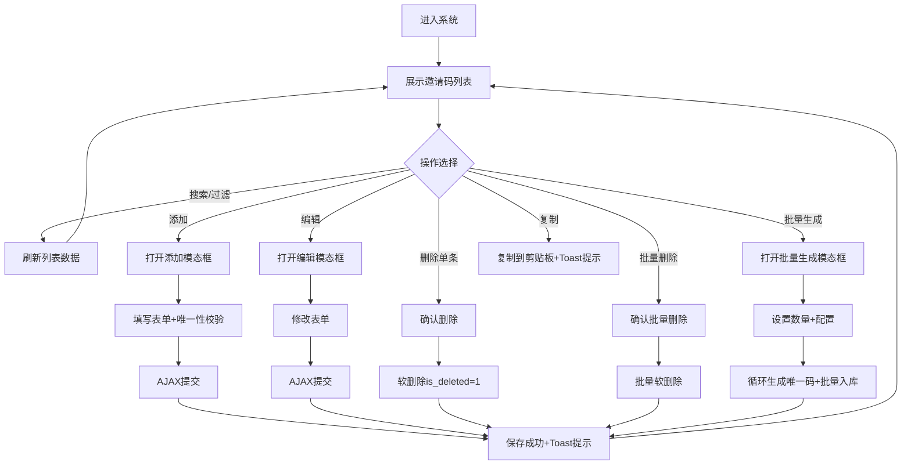

## 1. 产品概述

邀请码全生命周期管理系统，基于PHP 5.6 + MySQL + Bootstrap构建，提供邀请码的生成、管理、分发和回收等完整流程。目标用户为系统管理员，用于管理用户注册邀请、活动推广码、特权发放等场景。

- 主要解决：邀请码生成不规范、使用状态追踪困难、批量操作效率低下等问题
- 核心价值：安全高效、操作便捷、数据可追溯

## 2. 核心功能

### 2.1 用户角色

| 角色 | 注册方式 | 核心权限 |
|------|----------|----------|
| 系统管理员 | 预设账号 | 邀请码全功能管理、批量操作、数据导出 |

### 2.2 功能模块

1. **邀请码列表页**：分页表格展示、搜索过滤、状态筛选、批量操作入口
2. **邀请码管理**：添加（自定义/自动生成）、编辑、软删除、一键复制
3. **批量操作**：批量生成（指定数量+统一配置）、批量删除

### 2.3 页面详情

| 页面名称 | 模块名称 | 功能描述 |
|----------|----------|----------|
| 邀请码列表 | 顶部工具栏 | 搜索框、状态筛选下拉、批量生成按钮、批量删除按钮、添加按钮 |
| 邀请码列表 | 数据表格 | 复选框、邀请码、状态标签、有效期、使用人、备注、创建时间、操作列 |
| 邀请码列表 | 分页组件 | 上一页/下一页、页码跳转、每页条数选择 |
| 添加/编辑模态框 | 表单区域 | 邀请码输入（自动生成开关）、状态选择、有效期设置、使用人输入、备注 |
| 批量生成模态框 | 表单区域 | 生成数量、统一有效期、统一备注 |

## 3. 核心流程

### 3.1 主要用户流程

1. **查看邀请码列表**：管理员进入系统，默认展示所有未删除邀请码，按创建时间倒序排列；可输入关键词模糊搜索，或按状态过滤筛选。
2. **添加邀请码**：点击"添加邀请码"按钮，弹出模态框；可选择自动生成唯一邀请码或手动输入，填写有效期和备注后提交；系统循环校验邀请码唯一性后保存。
3. **编辑邀请码**：点击操作列"编辑"按钮，弹出编辑模态框；可修改状态、有效期、使用人（状态为已使用时必填）、备注；提交后更新数据。
4. **删除邀请码**：点击单条删除或勾选多条后点击批量删除；弹出确认提示；确认后执行软删除（is_deleted标记），列表实时刷新。
5. **复制邀请码**：点击操作列"复制"按钮，邀请码内容自动复制到剪贴板，toast提示成功。
6. **批量生成邀请码**：点击"批量生成"按钮，弹出模态框；设置生成数量、统一有效期和备注；提交后系统循环生成唯一邀请码并批量入库。

### 3.2 Mermaid 流程图

## 4. 用户界面设计

### 4.1 设计风格

- **主色调**：深蓝色 (#1e3a8a) 作为品牌色，搭配青绿色 (#0d9488) 作为成功/强调色
- **辅助色**：黄色 (#f59e0b) 用于警告/未使用状态，红色 (#ef4444) 用于危险/已过期状态，灰色系用于文字和背景
- **按钮样式**：圆角4px，主按钮深蓝色填充带悬停渐变，次要按钮白色边框填充
- **字体**：中文使用"PingFang SC"、"Microsoft YaHei"，英文使用"Segoe UI"、"Helvetica Neue"，表格字号14px，标题18px
- **布局风格**：卡片式布局，主内容区使用白色圆角卡片，带轻微阴影和内边距，顶部固定导航栏
- **图标**：使用Font Awesome图标库，线性风格，尺寸统一

### 4.2 页面设计概述

| 页面名称 | 模块名称 | UI元素 |
|----------|----------|--------|
| 邀请码列表 | 顶部导航栏 | 深蓝色背景、白色Logo文字、右侧用户信息下拉 |
| 邀请码列表 | 内容卡片 | 白色圆角卡片、内边距24px、box-shadow: 0 1px 3px rgba(0,0,0,0.1) |
| 邀请码列表 | 工具栏 | 搜索框带图标、状态下拉、主色调按钮组、左右浮动布局 |
| 邀请码列表 | 数据表格 | Bootstrap Table、斑马纹、悬停高亮、状态标签用不同颜色背景 |
| 邀请码列表 | 分页区 | 居中对齐、当前页蓝色高亮、跳转输入框 |
| 模态框 | 对话框 | Bootstrap Modal、淡入淡出动画、顶部标题栏带关闭按钮 |
| 模态框 | 表单 | 标签左对齐、输入框圆角、必填红星标记、底部按钮组 |
| Toast提示 | 消息 | 右上角弹出、3秒自动消失、成功绿色/错误红色/警告黄色 |

### 4.3 响应式

桌面端优先设计，使用Bootstrap栅格系统适配移动端：
- 桌面端 (≥992px)：完整表格展示，工具栏水平排列
- 平板端 (768px~991px)：表格横向滚动，操作按钮缩小
- 手机端 (<768px)：搜索框独占一行，批量操作按钮堆叠，表格可左右滑动

### 4.4 交互动效

- 页面加载：卡片元素淡入上移（stagger延迟50ms）
- 按钮悬停：背景色渐变+轻微上浮（translateY -1px）+ 阴影加深
- Toast提示：从右侧滑入，消失时淡出+上移
- 模态框：遮罩层淡入，对话框从上方缩放出现
- 表格行：悬停时背景色过渡（0.2s ease）
- 复制按钮：点击后图标切换为对勾1秒后恢复
