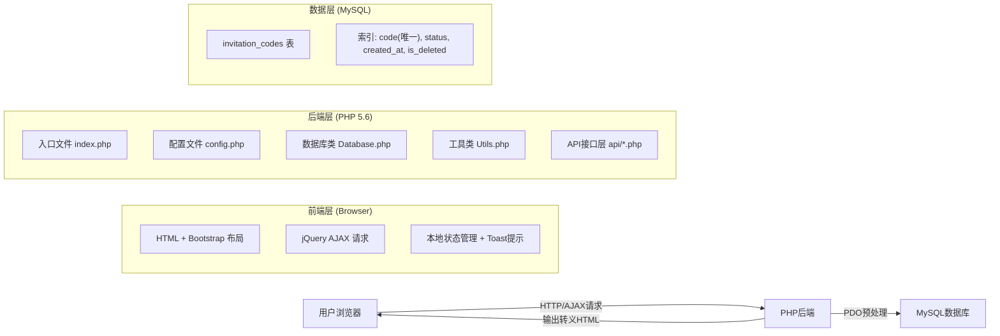
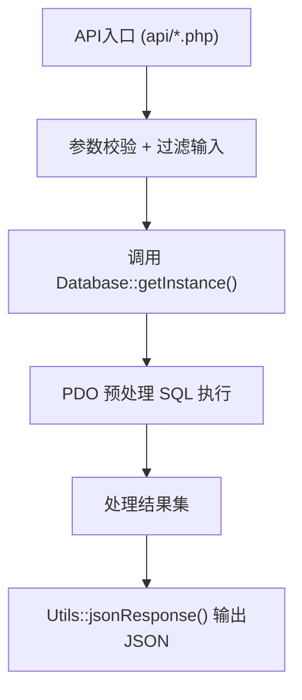
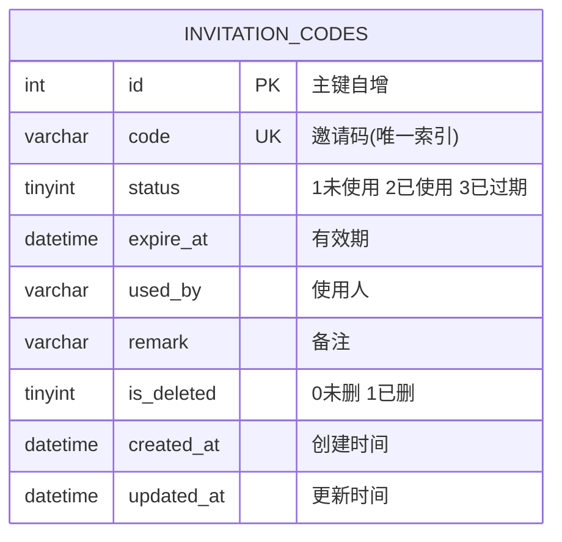

## 1. 架构设计



## 2. 技术描述

- **前端**：HTML5 + Bootstrap 3.4.1 + jQuery 3.6.0 + Font Awesome 4.7.0
- **后端**：PHP 5.6（PDO扩展）
- **数据库**：MySQL 5.6+（utf8mb4字符集）
- **通信协议**：HTTP/HTTPS，前后端以JSON格式交互
- **安全机制**：PDO预处理防SQL注入、htmlspecialchars()防XSS、CSRF Token验证

## 3. 目录结构

| 路径 | 用途 |
|------|------|
| `/` | 项目根目录 |
| `index.php` | 主页面入口（列表展示） |
| `config.php` | 数据库配置 |
| `includes/Database.php` | PDO数据库单例类 |
| `includes/Utils.php` | 通用工具类（生成邀请码、JSON响应等） |
| `api/list.php` | 获取邀请码列表（支持分页/搜索/过滤） |
| `api/create.php` | 添加单条邀请码 |
| `api/batch_create.php` | 批量生成邀请码 |
| `api/update.php` | 编辑邀请码 |
| `api/delete.php` | 单条软删除 |
| `api/batch_delete.php` | 批量软删除 |
| `sql/init.sql` | 数据库初始化SQL（建表+索引+测试数据） |
| `assets/css/app.css` | 自定义样式 |
| `assets/js/app.js` | 前端交互逻辑 |

## 4. API 接口定义

### 4.1 通用响应格式

```json
{
  "code": 0,
  "message": "操作成功",
  "data": {}
}
```

| 字段 | 类型 | 说明 |
|------|------|------|
| code | int | 0=成功，非0=错误码 |
| message | string | 提示信息 |
| data | mixed | 响应数据 |

### 4.2 接口列表

#### 1. 获取列表 `GET /api/list.php`

请求参数：
| 参数 | 类型 | 必填 | 说明 |
|------|------|------|------|
| page | int | 否 | 页码，默认1 |
| page_size | int | 否 | 每页条数，默认10 |
| keyword | string | 否 | 邀请码模糊搜索关键词 |
| status | int | 否 | 状态过滤：0=全部 1=未使用 2=已使用 3=已过期 |

响应 data：
```json
{
  "total": 100,
  "page": 1,
  "page_size": 10,
  "list": [
    {
      "id": 1,
      "code": "ABC123XYZ",
      "status": 1,
      "expire_at": "2026-12-31 23:59:59",
      "used_by": "",
      "remark": "测试邀请码",
      "created_at": "2026-06-20 10:00:00"
    }
  ]
}
```

#### 2. 添加邀请码 `POST /api/create.php`

请求参数：
| 参数 | 类型 | 必填 | 说明 |
|------|------|------|------|
| code | string | 否 | 自定义邀请码，空则自动生成 |
| expire_at | string | 是 | 有效期 (YYYY-MM-DD HH:mm:ss) |
| remark | string | 否 | 备注 |

#### 3. 批量生成 `POST /api/batch_create.php`

请求参数：
| 参数 | 类型 | 必填 | 说明 |
|------|------|------|------|
| count | int | 是 | 生成数量 (1~1000) |
| expire_at | string | 是 | 统一有效期 |
| remark | string | 否 | 统一备注 |

响应 data: `{"success_count": 100}`

#### 4. 编辑邀请码 `POST /api/update.php`

请求参数：
| 参数 | 类型 | 必填 | 说明 |
|------|------|------|------|
| id | int | 是 | 邀请码ID |
| status | int | 是 | 状态 1=未使用 2=已使用 3=已过期 |
| expire_at | string | 是 | 有效期 |
| used_by | string | 条件必填 | status=2时必填 |
| remark | string | 否 | 备注 |

#### 5. 单条删除 `POST /api/delete.php`

请求参数：
| 参数 | 类型 | 必填 | 说明 |
|------|------|------|------|
| id | int | 是 | 邀请码ID |

#### 6. 批量删除 `POST /api/batch_delete.php`

请求参数：
| 参数 | 类型 | 必填 | 说明 |
|------|------|------|------|
| ids | array | 是 | ID数组 [1,2,3,...] |

## 5. 服务器架构



## 6. 数据模型

### 6.1 ER 图



### 6.2 DDL 建表语句

```sql
CREATE TABLE `invitation_codes` (
  `id` INT UNSIGNED NOT NULL AUTO_INCREMENT COMMENT '主键',
  `code` VARCHAR(32) NOT NULL COMMENT '邀请码',
  `status` TINYINT UNSIGNED NOT NULL DEFAULT 1 COMMENT '状态:1未使用 2已使用 3已过期',
  `expire_at` DATETIME NOT NULL COMMENT '有效期',
  `used_by` VARCHAR(64) DEFAULT NULL COMMENT '使用人',
  `remark` VARCHAR(255) DEFAULT NULL COMMENT '备注',
  `is_deleted` TINYINT UNSIGNED NOT NULL DEFAULT 0 COMMENT '是否删除:0否 1是',
  `created_at` DATETIME NOT NULL DEFAULT CURRENT_TIMESTAMP COMMENT '创建时间',
  `updated_at` DATETIME NOT NULL DEFAULT CURRENT_TIMESTAMP ON UPDATE CURRENT_TIMESTAMP COMMENT '更新时间',
  PRIMARY KEY (`id`),
  UNIQUE KEY `uk_code` (`code`),
  KEY `idx_status` (`status`),
  KEY `idx_created_at` (`created_at`),
  KEY `idx_is_deleted` (`is_deleted`)
) ENGINE=InnoDB DEFAULT CHARSET=utf8mb4 COMMENT='邀请码表';
```

### 6.3 初始测试数据

```sql
INSERT INTO `invitation_codes` (`code`, `status`, `expire_at`, `used_by`, `remark`) VALUES
('TEST001', 1, '2026-12-31 23:59:59', NULL, '测试邀请码-未使用'),
('TEST002', 2, '2026-06-30 23:59:59', 'user_a@example.com', '测试邀请码-已使用'),
('TEST003', 3, '2025-12-31 23:59:59', NULL, '测试邀请码-已过期');
```
